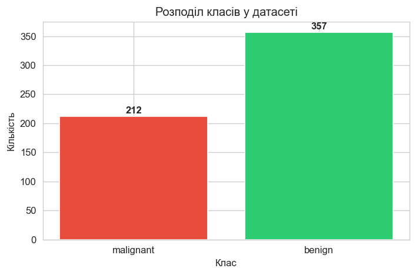
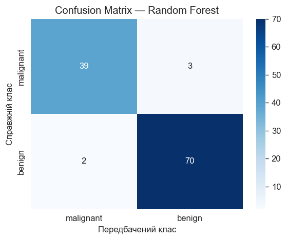
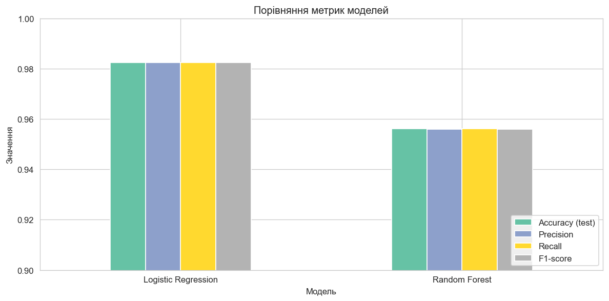
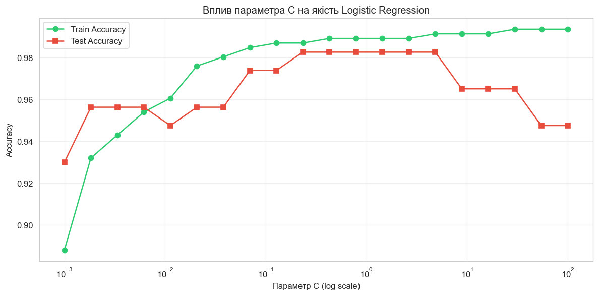

# Лабораторна робота №1

**Побудова повного циклу машинного навчання (ML pipeline) з використанням бібліотек Python**

Дисципліна: **Машинне навчання**

Виконав: студент групи 12-441 — Кусік Ілля Анатолійович

Івано-Франківськ, 2026

---

## МЕТА РОБОТИ

Сформувати практичні навички роботи з Python-екосистемою для машинного навчання, засвоїти поняття train/test split, реалізувати базову модель класифікації, навчитися оцінювати якість моделі та аналізувати результати.

---

## ОПИС ДАТАСЕТУ

Для виконання роботи використано вбудований датасет **Breast Cancer Wisconsin** з бібліотеки scikit-learn.

- **Кількість об'єктів:** 569
- **Кількість ознак:** 30 (числові)
- **Кількість класів:** 2 (malignant, тобто злоякісна; benign, тобто доброякісна)
- **Баланс класів:** 212 (37.3%) злоякісних, 357 (62.7%) доброякісних

Датасет не містить пропущених значень. Розподіл класів є помірно незбалансованим, проте не потребує додаткових методів балансування для baseline-моделей.

---

## ПІДГОТОВКА ДАНИХ

Дані було розділено на тренувальну (80%) та тестову (20%) вибірки за допомогою функції `train_test_split` з параметром `stratify=y` для збереження пропорцій класів.

Стандартизацію ознак виконано за допомогою `StandardScaler`:

- `fit_transform()`: застосовано до тренувальних даних;
- `transform()`: застосовано до тестових даних (без повторного обчислення параметрів масштабування, щоб уникнути витоку інформації).

Для відтворюваності результатів у всіх операціях використано параметр `random_state=42`.

---

## ОПИС МОДЕЛЕЙ

Побудовано та навчено дві baseline-моделі класифікації:

1. **Logistic Regression**: лінійна модель класифікації. Параметри: `random_state=42`, `max_iter=10000`.
2. **Random Forest**: ансамблева модель на основі дерев рішень. Параметри: `random_state=42`, решта параметрів за замовчуванням (100 дерев).

---

## РЕЗУЛЬТАТИ ЕКСПЕРИМЕНТІВ

### Зведена таблиця метрик

| Модель             | Accuracy | Precision | Recall | F1-score |
|--------------------|----------|-----------|--------|----------|
| Logistic Regression | 0.9825  | 0.9825    | 0.9825 | 0.9825   |
| Random Forest       | 0.9561  | 0.9561    | 0.9561 | 0.9560   |

### Confusion Matrix

 

*Confusion Matrix для Logistic Regression (ліворуч) та Random Forest (праворуч)*

### Порівняння метрик

### Дослідження гіперпараметра C (додаткове завдання)

Досліджено вплив параметра регуляризації C на якість логістичної регресії в діапазоні від 10⁻³ до 10².

---

## АНАЛІЗ РЕЗУЛЬТАТІВ

**Порівняння моделей.** Logistic Regression показала кращий результат (Accuracy = 0.9825) порівняно з Random Forest (Accuracy = 0.9561). Це пояснюється тим, що дані добре лінійно розділяються після стандартизації, і лінійна модель ефективно знаходить оптимальну межу рішення.

**Перенавчання (overfitting).** Logistic Regression демонструє мінімальну різницю між train (0.9890) та test (0.9825) accuracy — лише 0.0066, що свідчить про відсутність перенавчання. Random Forest має train accuracy = 1.0000 при test accuracy = 0.9561, різниця 0.0439 наближається до порогу 0.05, що може свідчити про початкові ознаки overfitting.

**Найважливіші ознаки.** За результатами аналізу feature importance з Random Forest найбільш інформативними виявились ознаки worst perimeter, worst concave points та worst radius.

**Крос-валідація.** 5-fold крос-валідація підтвердила стабільність: Logistic Regression отримала 0.9802 (± 0.0128), Random Forest — 0.9538 (± 0.0235).

---

## ВИСНОВКИ

1. Побудовано повний цикл машинного навчання (ML pipeline) від завантаження та підготовки даних до оцінки якості моделей та аналізу результатів.
2. Обидві моделі (Logistic Regression та Random Forest) продемонстрували високу якість класифікації на датасеті Breast Cancer Wisconsin.
3. Стандартизація ознак є важливим етапом підготовки даних, особливо для моделей, чутливих до масштабу (зокрема Logistic Regression).
4. Крос-валідація підтвердила стабільність та узагальнювальну здатність побудованих моделей.
5. Дослідження гіперпараметра C показало його вплив на якість логістичної регресії та дозволило визначити оптимальне значення.
