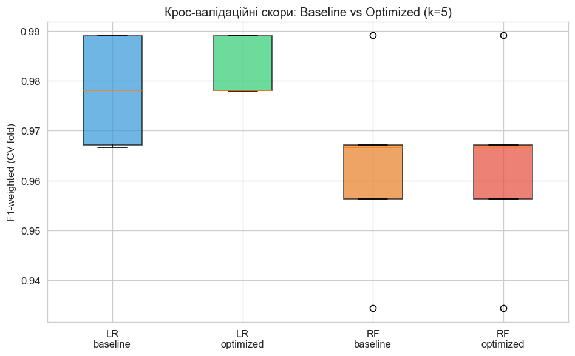
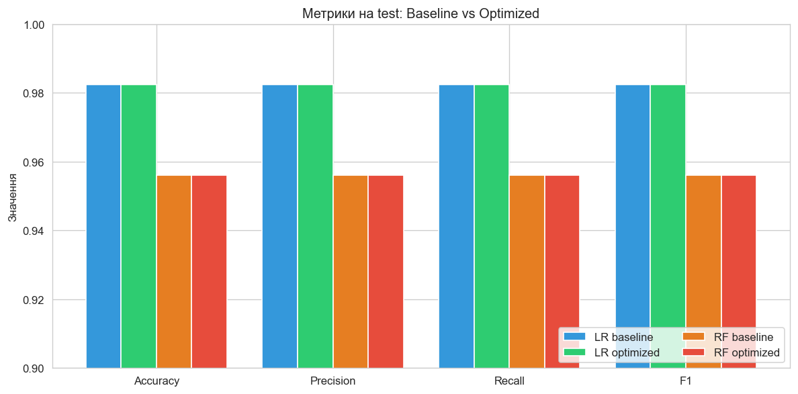
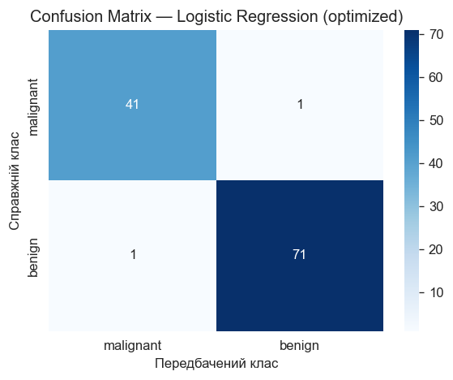
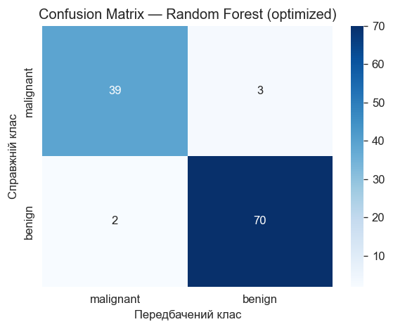

# Лабораторна робота №2

**Оптимізація та валідація ML-моделі: підбір гіперпараметрів і крос-валідація**

Дисципліна: **Машинне навчання**

Виконав: студент групи 12-441 — Кусік Ілля Анатолійович

Івано-Франківськ, 2026

---

## МЕТА РОБОТИ

Освоїти інструменти валідації якості ML-моделі (крос-валідація) та автоматизованого підбору гіперпараметрів (`RandomizedSearchCV`), порівняти оптимізовані моделі з baseline з Лабораторної №1 за єдиною метрикою F1.

---

## ОПИС ДАТАСЕТУ

Той самий датасет, що й у [Лабораторній №1](../lab_1/README.md): **Breast Cancer Wisconsin** (`sklearn.datasets.load_breast_cancer`), 569 об'єктів, 30 числових ознак, бінарна класифікація (malignant / benign), помірно незбалансований (37.3% / 62.7%).

Для чесного порівняння застосовано той самий split (80/20, `stratify=y`, `random_state=42`) та той самий `StandardScaler`.

---

## BASELINE (з Лабораторної №1)

Зафіксовано вихідну точку — дві моделі з дефолтними параметрами, тренувані на стандартизованих ознаках:

| Модель              | Accuracy | Precision | Recall | F1     |
|---------------------|----------|-----------|--------|--------|
| Logistic Regression | 0.9825   | 0.9825    | 0.9825 | 0.9825 |
| Random Forest       | 0.9561   | 0.9561    | 0.9561 | 0.9560 |

Ці числа відтворюються в першій секції `lab_2.ipynb` як sanity-check.

---

## МЕТОДОЛОГІЯ

**1. Pipeline.** `StandardScaler` обгорнуто разом з класифікатором у `sklearn.pipeline.Pipeline`. Це критично для коректної крос-валідації: скейлер fit'иться всередині кожного фолду, а не один раз на весь train — інакше параметри масштабування бачать валідаційну підмножину, що дає оптимістично завищені CV-оцінки.

**2. Крос-валідація.** `StratifiedKFold(n_splits=5, shuffle=True, random_state=42)`. Стратифікація зберігає пропорцію класів у кожному фолді, що важливо при незбалансованих класах.

**3. Підбір гіперпараметрів.** `RandomizedSearchCV` з `n_iter=30`, `scoring='f1_weighted'`, `n_jobs=-1`. Обрано замість `GridSearchCV` за принципом 80/20: за ту саму обчислювальну вартість покриває значно ширший простір параметрів, а для практичних задач із «гладким» ландшафтом функції якості цього достатньо.

**4. Основна метрика.** `F1-weighted` — узгоджена зі звітом Лаби 1 і враховує дисбаланс класів (у медичному контексті важливо не пропустити злоякісні випадки).

---

## СІТКИ ГІПЕРПАРАМЕТРІВ

**Logistic Regression**

| Параметр          | Простір пошуку                  |
|-------------------|---------------------------------|
| `C`               | `loguniform(1e-3, 1e2)`         |
| `penalty`         | `l1`, `l2`                      |
| `solver`          | `liblinear`, `saga`             |
| `max_iter`        | `10000`                         |

**Random Forest**

| Параметр            | Простір пошуку              |
|---------------------|-----------------------------|
| `n_estimators`      | `100, 200, 300, 500`        |
| `max_depth`         | `None, 5, 10, 20`           |
| `min_samples_split` | `2, 5, 10`                  |
| `min_samples_leaf`  | `1, 2, 4`                   |
| `max_features`      | `sqrt`, `log2`              |

---

## РЕЗУЛЬТАТИ

### Найкращі параметри (за результатами `RandomizedSearchCV`)

- **Logistic Regression:** `C=0.1695`, `penalty='l2'`, `solver='liblinear'`.
- **Random Forest:** `n_estimators=100`, `max_depth=20`, `min_samples_split=2`, `min_samples_leaf=1`, `max_features='sqrt'`.

### Baseline vs Optimized — зведена таблиця

| Модель                            | Accuracy | Precision | Recall | F1     | CV F1 (mean ± std)   |
|-----------------------------------|----------|-----------|--------|--------|----------------------|
| Logistic Regression — baseline    | 0.9825   | 0.9825    | 0.9825 | 0.9825 | 0.9780 ± 0.0099      |
| Logistic Regression — optimized   | 0.9825   | 0.9825    | 0.9825 | 0.9825 | **0.9824 ± 0.0054**  |
| Random Forest — baseline          | 0.9561   | 0.9561    | 0.9561 | 0.9560 | 0.9627 ± 0.0177      |
| Random Forest — optimized         | 0.9561   | 0.9561    | 0.9561 | 0.9560 | 0.9627 ± 0.0177      |

### Графіки

 

---

## АНАЛІЗ РЕЗУЛЬТАТІВ

**Logistic Regression.** Точкові метрики на test (Accuracy, Precision, Recall, F1) не змінилися — baseline вже був близький до стелі датасету. Проте **крос-валідаційний F1 зріс з 0.9780 до 0.9824, а стандартне відхилення впало майже вдвічі (0.0099 → 0.0054)**. Це і є головна практична цінність: оптимізована модель стабільніше поводиться на різних підмножинах даних. Обраний `C ≈ 0.17` сильніше регуляризує модель, ніж дефолтний `C=1.0`, що зменшує варіативність між фолдами.

**Random Forest.** `RandomizedSearchCV` зупинився на параметрах, майже тотожних дефолтним (100 дерев, `max_features='sqrt'`), тому ані test-, ані CV-метрики не змінились. Це закономірний результат: датасет малий (455 train-прикладів), і ансамбль дерев уже насичений. Для помітного покращення RF треба було б або розширити feature engineering, або спробувати boosting (XGBoost/LightGBM) — що виходить за межі цієї лабораторної.

**Загальне спостереження.** На простих, добре роздільних датасетах типу Breast Cancer Wisconsin підбір гіперпараметрів дає скромний приріст на test, але помітно стабілізує CV-оцінку. Відсутність leakage (через `Pipeline`) та стратифікована CV — ключові умови, щоб цифри були надійними.

---

## ВИСНОВКИ

1. Побудовано повний пайплайн валідації та оптимізації ML-моделі (`Pipeline` + `StratifiedKFold` + `RandomizedSearchCV`), що коректно відокремлює train/validation/test та уникає витоку інформації.
2. Підбір гіперпараметрів для Logistic Regression покращив стабільність крос-валідаційного F1 (std зменшено з 0.0099 до 0.0054) при збереженні високих метрик на test.
